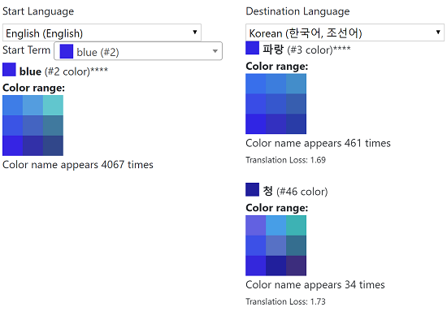

# Model

This folder contains the calculations and models we made about colors and color names.

## Color Calculations (without color names)
The "color_info_pre_naming/" folder has data color spaces and color bins that will be used in later steps once we have color names.

Created by:
- The scripts in: 00_pre-processing-colors

## Cleaned Color Names
"cleaned_color_names.csv" contains the cleaned version of the raw dataset. Besides removing data, we:
- update the "name" field to include a simplified matching name (e.g., fixing typos, removing diacritic marks)
- the "entered_name" field is the name as it was entered
- the "standardized_entered_name" has some standardization steps run on it (e.g., all lowercase, trimmed white space)

Created by: 
- processing_scripts/01_data_cleaning/01_dataCleaning.js

## Removed Color Data
"removed_color_data.csv" is the raw data that was excluded in our data cleaning process

Created by: 
- processing_scripts/01_data_cleaning/01_dataCleaning.js

## Language Info

"lang_info.csv" contains information about the color naming data from each language.

Fields:
- lang: The language name (long form, e.g., "Korean (한국어, 조선어)")
- langAbv: The 2 letter language abbreviation (for where we have it). E.g., "ko"
- numLineNames: The number of names collected when we asking only to name rgb hue color line (max(r,g,b) == 255, min(r,g,b) == 0)
- numFullNames: The number of names collected when asking to name colors chosen from the whole rgb color space
- numHueColorNames: The number of color names that are rgb hue colors (regardless of of what color set was being asked)
- numNonHueColorNames: The number of color names that are rgb hue colors (regardless of of what color set was being asked, though theoretically, this should only be "full" color names)
- numFilteredTerms: The number of color names kept for a language (after filtering out those that didn't have sufficient data)
- hue_correction_multiplier: a multiplier for the language to rebalance the rgb hue colors based on how many we expect in an even distribution in LAB color space
- non_hue_correction_multiplier: a multiplier for the language to rebalance the rgb non-hue colors based on how many we expect in an even distribution in LAB color space

Created by:
- processing_scripts/02_initial_processing/01_getBasicFullColorInfo.js

## Full Colors Info

"full_colors_info.csv" contains information about color terms in different languages.

Fields:
- lang: The language of the color term (long form)
- lang_abv: Two letter abbreviation of the language
- simplifiedName: the simplified matching "name" from cleaned_color_names.csv used to group color terms
- commonName: For the color term, the most common "standardized_entered_name" used for it
- totalColorFraction: The total fraction of color names for this language are this color term (balancing in LAB space and for the expected rgb hue color ratio)
- avgColorRGBCode: The average rgb color for this term (balancing in LAB space and for the expected rgb hue color ratio)
- avgL, avgA, avgB: The average LAB color for this term (balancing in LAB space and for the expected rgb hue color ratio)
- numFullNames: The number of times this name was given when we were asking only to name rgb hue color line (max(r,g,b) == 255, min(r,g,b) == 0)
- numLineNames: The number of times this name was given when we were asking to name colors chosen from the whole rgb color space

Created by:
- processing_scripts/02_initial_processing/01_getBasicFullColorInfo.js

## Binned Hue Colors

The "binned_hue_colors/" folder has datasets from our binning the rgb hue line dataset (bins based on LAB color space distances).

## Binned Full Colors

The "binned_full_colors/" folder has datasets from our binning all the color names given in LAB color space.

## Translation loss

The "translation_loss/" folder has datasets comparing the distribution of all pairs of color terms in two languages, calculating the LAB distance to signify the "translation loss" of going from one term to another.

## Color SOM Patches

The "colorSOMPatches.json" file has Self-Organizing maps for each color term that are a 2D representation of the distribution of colors for that term. The 2D SOMs are of possible sizes 4 (2x2), 9 (3x3), and 16(4x4), with the larger ones only being made if there is sufficient data.

Fields:

- For each Language (2 letter abbreviation), for each term in that language (simplifiedName):
  - CommonColorName: The commonName for that color term
  - numRecords: The number of color name data points for that term
  - numLineData The number of times this name was given when we were asking only to name rgb hue color line (max(r,g,b) == 255, min(r,g,b) == 0)
  - numFullData: The number of times this name was given when we were asking to name colors chosen from the whole rgb color space
  - totalColorFraction: The total fraction of color names for this language are this color term (balancing in LAB space and for the expected rgb hue color ratio)
  - representativeColor: The average rgb color for this term (balancing in LAB space and for the expected rgb hue color ratio)
  - colorNodes4/colorNodes9/colorNodes16: a 2D array of color nodes, each with:
    - lab: an object with the l, a, and b coordinates for this node
    - rgb: a string of the rgb color for this node
    - PCgN: Probability of a color term (C) given this SOM node (N) (P(C|N)) (note: we should rename this a pTN)

Created By:
- processing_scripts/03_advanced_processing/createColorSOMs.js

## Scheme Color Data
"scheme_color_names.json" contains information on the distribution of color names along common color palettes used in scientific visualization. (For now only English and Korean)

Fields:
- lang : Language (long version)
- binNum/binL/binA/binB : Index of Color Bin
- term : the simplified matching color name ("name" from cleaned_color_names.csv)
- cnt : The number of color names given to that bin
- pCT : Probability of a color (c) given a term (t) (P(c|t))
- pTC : Probability of a term (t) given a color (c) (P(t|c))
- rgb : The rgb value for the LAB bin
- schema : Color palette being modeled (e.g, "viridis")

Created by:
- processing_scripts/03_advanced_processing/getSchemeColorNames.js

## Disclaimer

Note: We represent the color labels provided by the participants in our study, which may include misspellings, but also whatever racial biases they have (e.g., the color "skin"). This is not meant to be a prescriptive definition of what colors  fit what labels.

