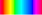

# Model

This folder contains the calculations and models we made about colors and color names.

## Color Calculations (without color names)
The "color_info_pre_naming/" folder has data color spaces and color bins that will be used in later steps once we have color names.

Created by:
- The scripts in: 00_pre-processing-colors

## Cleaned Color Names
"cleaned_color_names.csv" contains the cleaned version of the raw dataset. Separated into separate files per language in the folder [cleaned_color_info_by_lang](cleaned_color_info_by_lang).

Fields:
- **participantId:** The id of the participant (0 for some data where there were errors in the study)
- **langAbv:** Two letter abbreviation of the language name (if one could be found)
- **lang:** The long form version of the language name
- **name:** The simplified matching color name. Not meant for display. (e.g., all lowercase, removed spaces, removed diacritics etc.)
- **standardized_entered_name:** has some standardization steps run on it (e.g., all lowercase, trimmed white space, add standard color word ending to languages like Chinese). Meant to be consistent as an option for display name
- **entered_name:** the name as entered by the user
- **colorSpace:** the color space of the tile being named (regular "rgb" or HDR: "p3' or "rec2020")
- **r/g/b:** the r, g, or b value for the color in the given colorSpace
- **trialNum:** the step number in the study
- **tileNum:** for the given step, what tile number was this tile in the order of display
- **rgbSet:** whether we were asking users to name tiles that were only on the full hue color "line" , or if we were asking about any color from the "full" color space (e.g., brown, dark green, beige, etc.)
- **background:** The background color behind the tiles: "white" for light more, and "black" for dark mode
- **locale:** The language the instructions were given in (2 code abbreviation)
- **studyVersion:** The version of the study being answered in (see the README files in the raw study folders)
- **originalLangAbv:** If we changed the language the user said they answered in to the one we believe they answered in, this shows the original language

Created by: 
- processing_scripts/01_data_cleaning/01_dataCleaning.js

## Removed Color Data
"removed_color_data.csv" is the raw data that was excluded in our data cleaning process. Separated into separate files per language in the folder [cleaned_color_info_by_lang](cleaned_color_info_by_lang).

It has most of the same fields as "cleaned_color_names.csv", but has an additional field:
- **reason_excluded:** Why this name was removed from the final cleaned dataset.

Created by: 
- processing_scripts/01_data_cleaning/01_dataCleaning.js

## Language Info

"lang_info.csv" contains information about the color naming data from each language.

Fields:
- **lang:** The language name (long form, e.g., "Korean (한국어, 조선어)")
- **langAbv:** The 2 letter language abbreviation (for where we have it). E.g., "ko"
- **numLineNames:** The number of names collected when we asking only to name rgb hue color line (max(r,g,b) == 255 or 1, min(r,g,b) == 0) 
- **numFullNames:** The number of names collected when asking to name colors chosen from the whole rgb color space
- **numLineColorTerms:** The number of hue color names kept for a language (after filtering out those that didn't have sufficient hue data)
- **numFullColorTerms:** The number of full color space color names kept for a language (after filtering out those that didn't have sufficient full color space data)

Created by:
- processing_scripts/02_initial_processing/01_getBasicFullColorInfo.js

## Basic Colors Info
"basic_colors_info.csv" contains information about the color naming data from each language. Separated into separate files per language in the folder [color_info_by_lang](color_info_by_lang).

Fields:
- **lang:** The language of the color term (long form)
- **lang_abv:** Two letter abbreviation of the language
- **commonName:** For the color term, the most common "standardized_entered_name" used for it
- **simplifiedName:** Tthe simplified matching "name" from cleaned_color_names.csv used to group color terms
- **numLineNames:** The number of times this color term was used when we asking only to name rgb hue color line (max(r,g,b) == 255 or 1, min(r,g,b) == 0) 
- **avgHueRGBCode:** The average hue color for all the times it was asked (treating the hue color line as a circle, and finding the average point along that circle). Not based on any binning, so no correcting for uneven sampling.
- **numFullNames:** The number of times this color term was used when asking to name colors chosen from the whole rgb color space
- **avgFullColorRGBCode:** The average full color space color for all the times it was asked. Not based on any binning, so no correcting for uneven sampling.
- **avgFullL, avgFullA, avgFullB:** The Oklab value of average full color space color for all the times it was asked. Not based on any binning, so no correcting for uneven sampling.

Created by:
- processing_scripts/02_initial_processing/01_getBasicFullColorInfo.js

## Hue Colors Info

"hue_colors_info.csv" contains information about hue color terms in different languages, based on the hue binning.

Fields:
- **lang:** The language of the color term (long form)
- **lang_abv:** Two letter abbreviation of the language
- **commonName:** For the color term, the most common "standardized_entered_name" used for it
- **simplifiedName:** the simplified matching "name" from cleaned_color_names.csv used to group color terms
- **(low/med/high)ResBlurTermFraction:** What percentage of hue colors are given this name (based on the low/med/high  blurred color binning)?
- **(low/med/high)ResBlurAvgRGBCode:** What is the average rgb hue color for this term (based on the low/med/high  blurred color binning)? (treating the hue color line as a circle, and finding the average point along that circle)
- **(low/med/high)ResBlurAvg(L/A/B):** What is the average Oklab hue color for this term (based on the low/med/high  blurred color binning)? (treating the hue color line as a circle, and finding the average point along that circle)

Created by:
- processing_scripts/02_initial_processing/02_getHueColorNames.js

## Full Colors Info

"full_colors_info.csv" contains information about full color space color terms in different languages, based on the hue binning.

Fields:
- **lang:** The language of the color term (long form)
- **lang_abv:** Two letter abbreviation of the language
- **commonName:** For the color term, the most common "standardized_entered_name" used for it
- **simplifiedName:** the simplified matching "name" from cleaned_color_names.csv used to group color terms
- **(tiny/low/med/high)ResBlurTermFraction:** What percentage of full color space colors are given this name (based on the tiny/low/med/high blurred full color binning of all color entries)?
- **(tiny/low/med/high)ResBlurAvgRGBCode:** What is the average rgb color for this term (based on the tiny/low/med/high blurred full color binning of all color entries)?
- **(tiny/low/med/high)ResBlurAvg(L/A/B):** What is the average Oklab hue color for this term (based on the tiny/low/med/high blurred full color binning of all color entries)?

Created by:
- processing_scripts/02_initial_processing/03_getFullColorNames.js

## Binned Hue Colors

The "binned_hue_colors/" folder has datasets from our binning the rgb hue line dataset (bins based on LAB color space distances).

## Binned Full Colors

The "binned_full_colors/" folder has datasets from our binning all the color names given in LAB color space.

## Translation loss

The "translation_loss/" folder has datasets comparing the distribution of all pairs of color terms in two languages, calculating the Oklab distance to signify the "translation loss" of going from one term to another.

## Color SOM Patches

The "colorSOMPatches.json" file has Self-Organizing maps for each color term that are a 2D representation of the distribution of colors for that term. The 2D SOMs are of possible sizes 4 (2x2), 9 (3x3), and 16(4x4), with the larger ones only being made if there is sufficient data.

See [Color Translator](https://idl.uw.edu/color-naming-in-different-languages/vis/color_translator.html)

Fields:

- For each Language (2 letter abbreviation), for each term in that language (simplifiedName):
  - **CommonColorName:** The commonName for that color term
  - **numRecords:** The number of color name data points for that term
  - **numLineData:** The number of times this name was given when we were asking only to name rgb hue color line (max(r,g,b) == 255, min(r,g,b) == 0)
  - **numFullData:** The number of times this name was given when we were asking to name colors chosen from the whole rgb color space
  - **totalColorFraction:** The total fraction of color names for this language are this color term (balancing in LAB space and for the expected rgb hue color ratio)
  - **representativeColor:** The average rgb color for this term (balancing in LAB space and for the expected rgb hue color ratio)
  - **colorNodes4/colorNodes9/colorNodes16:** a 2D array of color nodes, each with:
    - **lab:** an object with the l, a, and b coordinates for this node
    - **rgb:** a string of the rgb color for this node
    - **PCgN:** Probability of a color term (C) given this SOM node (N) (P(C|N)) (note: we should rename this a pTN)

Created By:
- processing_scripts/03_advanced_processing/createColorSOMs.js

## Scheme Color Data
"scheme_color_names.json" contains information on the distribution of color names along common color palettes used in scientific visualization. (For now only English and Korean)

See [Korean-English Viridis Color Spectrum](https://idl.uw.edu/color-naming-in-different-languages/vis/viridis.html)

Fields:
- **lang:** Language (long version)
- **binNum/binL/binA/binB:** Index of Color Bin
- **term:** the simplified matching color name ("name" from cleaned_color_names.csv)
- **cnt:** The number of color names given to that bin
- **pCT:** Probability of this color bin (c) given this term (t) (P(c|t))
- **pTC:** Probability of this term (t) given this color bin (c) (P(t|c))
- **rgb:** The rgb value for the LAB bin
- **schema:** Color palette being modeled (e.g, "viridis")

Created by:
- processing_scripts/03_advanced_processing/getSchemeColorNames.js

## Disclaimer

Note: We represent the color labels provided by the participants in our study, which may include misspellings, but also whatever racial biases they have (e.g., the color "skin"). This is not meant to be a prescriptive definition of what colors fit what labels.

