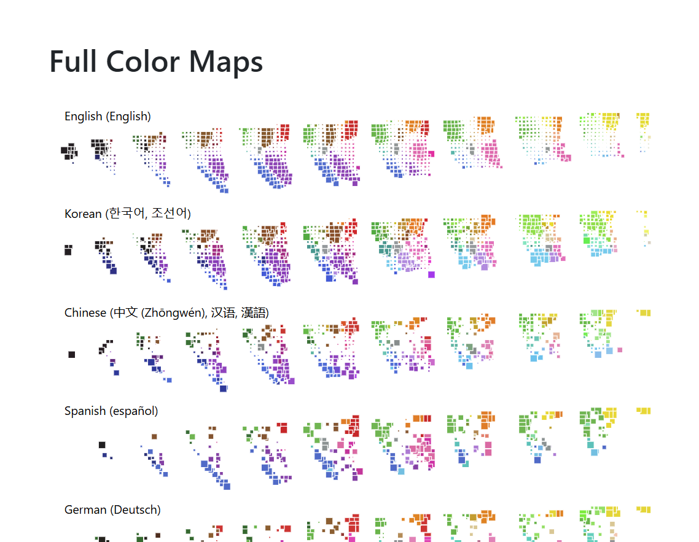

TODO...

See [Full Color Maps](https://idl.uw.edu/color-naming-in-different-languages/vis/full_color_maps.html)

Each color naming model is a JSON array of color-name pairs. Each pair has the below properties:

- lang : Language
- binNum/binL/binA/binB : Index of Color Bin
- term : Color name
- cnt : Count
- pCT : Probability of a color (c) given a term (t) (P(c|t))
- pTC : Probability of a term (t) given a color (c) (P(t|c))
- schema : (for scheme_color_model only) Schema