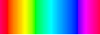
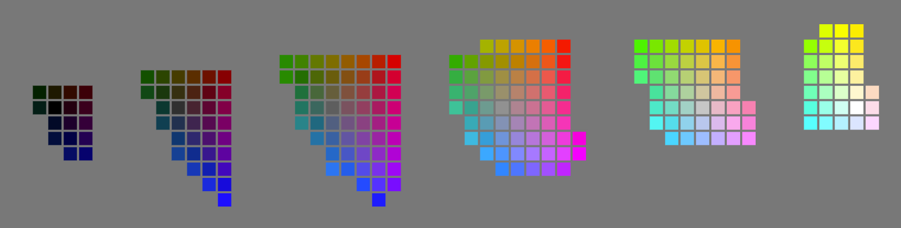
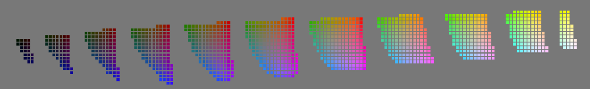
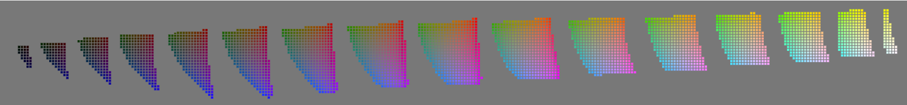

# Color Calculations (without color names)

In order to calculate color distances and generate color bins, we use the [LAB color space](https://en.wikipedia.org/wiki/CIELAB_color_space).

*Note: [D3's conversion between RGB and LAB has changed several times over the years](https://github.com/d3/d3-color/commits/main/src/lab.js), and we have updated to the latest version, but previous data collection and data calculations were made with older versions of LAB/RGB conversion.*

## Hue Colors
"hue_colors.json" contains each rgb hue color (max(r,g,b) == 255 && min(r,g,b) == 0) lined up in order (red, orange, yellow,..., purple, red), with LAB distance calculations between each one. Used both for collecting color names and displaying hue colors.

Fields:
- **rgb:** An object with the r, g, and b values for the color
- **lab:** An object with the l, a, and b values for the color
- **cumulative_dist:** The cumulative distance from the first hue color to the current one
- **next_dist:** The LAB distance between the current hue value and the next

Created by:
- processing_scripts/00_pre-processing-colors/hueColorGenerator.js

## LAB Hue Color Ratio
"lab_hue_color_ratio.json" contains information on the proportion of hue colors vs. non-hue colors when sampling evenly from LAB space (as we try to do when asking people to name full colors).

We do calculate this because we have extra "line" data of just the hue colors. By knowing what the proportion of hue colors to non-hue colors, we can add the "line" data to our dataset. Then in our calculations, we rebalance the number of hue colors (a lot from the "line" data and few from the "full" data) vs. non-hue colors.

Fields:
- **estimate_lab_delta:** the steps we increment l, a, and b values by as we sample LAB space
- **numHueColors:** The number of LAB values that converted the rgb hue colors (max(r,g,b) == 255 && min(r,g,b) == 0)
- **numNonHueColors:** The number of LAB values that converted to valid rgb colors that were not hue colors
- **hueColorRatio:** our estimated expected ratio of hue colors out of all rgb colors 

Created by:
- processing_scripts/00_pre-processing-colors/estimateHueColorPercentage.js

## Lab Bins
The "lab_bins_*.json" files have information on LAB bins at different bin sizes (20, 10, 20/3≈6.67). The bins are uniform cubes in LAB space. Since Lightness ranges from 0 to 100, and a and b vary along lightness, we have chosen to arrange the bins to have one bin centered at LAB 0,0,0 and one at LAB 100,0,0.

Some bins include LAB values that don't map into rgb space and may not even represent real colors. We choose a representative color for the bin and try to use the center of the bin as that color. But when the center of the bin doesn't map to a valid rgb color, we choose the closest rgb color in the bin to the center as the representative color.

20x20x20 LAB bins:

10x10x10 LAB bins:

(20/3)x(20/3)x(20/3) LAB bins:

Fields:

The json data is a 3D array **[l_bin][a_bin][b_bin]** (the number of a_bins and b_bins changes for at different levels based on which ones have rgb values that map into them):
- **l_bin, a_bin, b_bin:** the bin number (and indices used to get to this bin)
- **l_min, a_min, b_min:** the minimum values for l, a, and b in this bin
- **l_center, a_center, b_center:** the center l, a, and b values in this bin
- **l_max, a_max, b_max:** the maximum values for l, a, and b in this bin
- **center_rgb:** an object with the r,g,b values for the center of the bin (may not be a valid rgb value)
- **representative_rgb:** an object with r,g,b values that is the representative color for this bin (same as center if possible, but if not, closest rgb value in bin)
- **representative_lab:** an object with l,a,b values that is the representative color for this bin (same as center if possible, but if not, the lab value matching the closest rgb value in bin)
- **num_rgbs:** The number of rgb values that map into this bin *(note: due to rounding rgb values to whole numbers, LAB values in this bin may map to rgb values that map back into another bin, but we only count rgb values that map into this bin)*
- **lab_hue_color_ratio_est:** Our estimated expected ratio of hue colors that map into this bin out of all rgb colors that map into this bin when sampling evenly in LAB space

Created by:
- processing_scripts/00_pre-processing-colors/createLABBins.js
