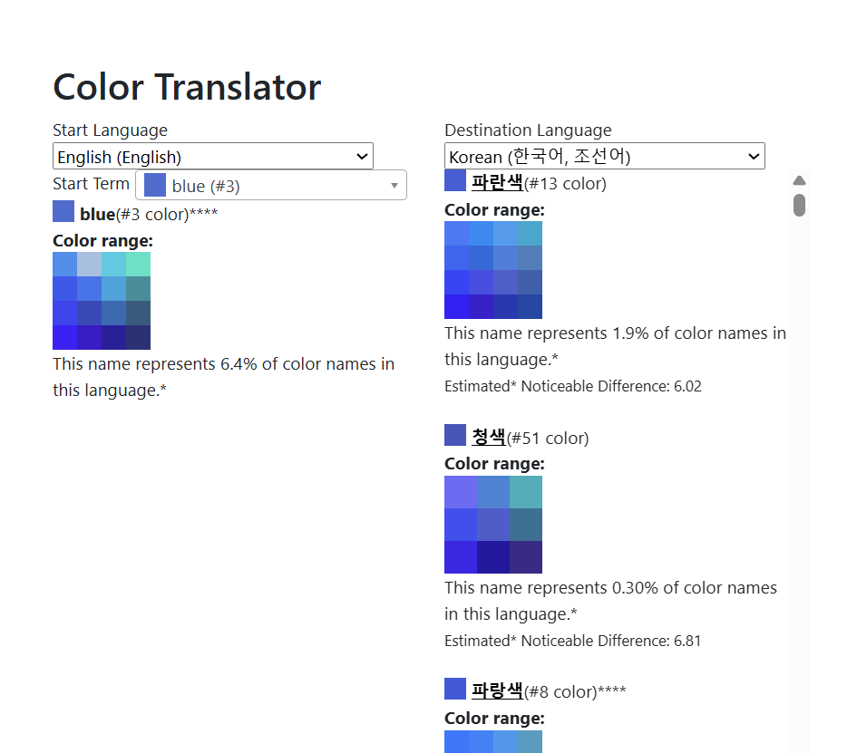
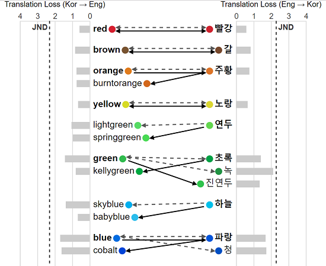

# Translation loss

This folder has datasets comparing the distribution of all pairs of color terms in two languages, calculating the LAB distance to signify the "translation loss" of going from one term to another.

See [Color Translator](https://idl.uw.edu/color-naming-in-different-languages/vis/color_translator.html)

And also [Korean-English Translation Comparisons](https://idl.uw.edu/color-naming-in-different-languages/vis/en-ko-translation-comparison.html)

## The translation loss calculation

The translation loss is calculated by using the binned full color names and comparing the probability distributions of the two terms (P(c|t): Probability of this color bin (c) given this term (t)). We use Earth Mover's Distance to compute the distance between these two probability distributions to find a final LAB distance.

You can find the calculated "most accurate" translation for a term by finding the term pair with the smallest distance.

You can also compare the LAB distances to the estimated "Just Noticeable Difference" value of 2.3 LAB distance (SHARMA G.: Digital Color Imaging Handbook. CRC press, 2002).

## Translation Loss Files
The translation loss information is stored as separate files for each translation pair: "translation_loss_LANG1_LANG2.json" where LANG1 and LANG2 are the 2 letter abbreviations fo the language.

*Note: We only save files for LANG1 <= LANG2 so as not to duplicate work and information.*

Each file is an array of all possible pairs of LANG1 terms to LANG2 terms. Each object in the array has the following fields:
- **LANG1term:** (e.g., "enterm", "koterm", "zhterm") The simplified matching term from language 1
- **LANG2term:** (e.g., "enterm", "koterm", "zhterm") The simplified matching term from language 2
- **dist:** The LAB Earth Mover's Distance between the probability distributions (P(c|t)) of LANG1term and LANG2term

*Note: When we are comparing a language with itself (LANG1 == LANG2), then instead of LANG1term and LANG2term fields, we use LANGterm and LANGterm2 (e.g., "enterm" and "enterm2" or "koterm" and "koterm2"). Also, to save work and duplicate information we only save a pair for the first term < the second term.*

Created by running two scripts:
- processing_scripts/03_advanced_processing/getTranslation_01.js
- processing_scripts/03_advanced_processing/getTranslation_02_EMDparallel.py