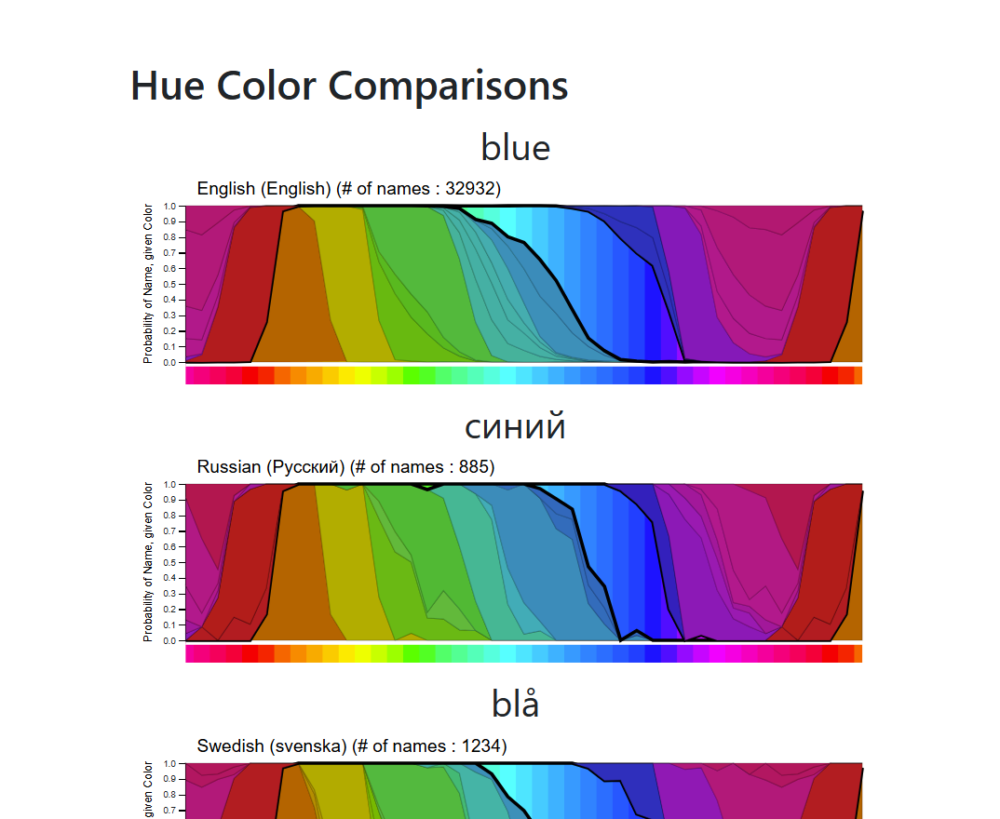

TODO...

See [Hue Color Comparisons](https://idl.uw.edu/color-naming-in-different-languages/vis/stacked-spectrum.html)

`translation_loss` is also an array having the translation losses between the top 100 English and Korean color name for full colors. 'dist' property indicate the distance (loss) between the English term (enTerm) and the Korean term (koTerm).